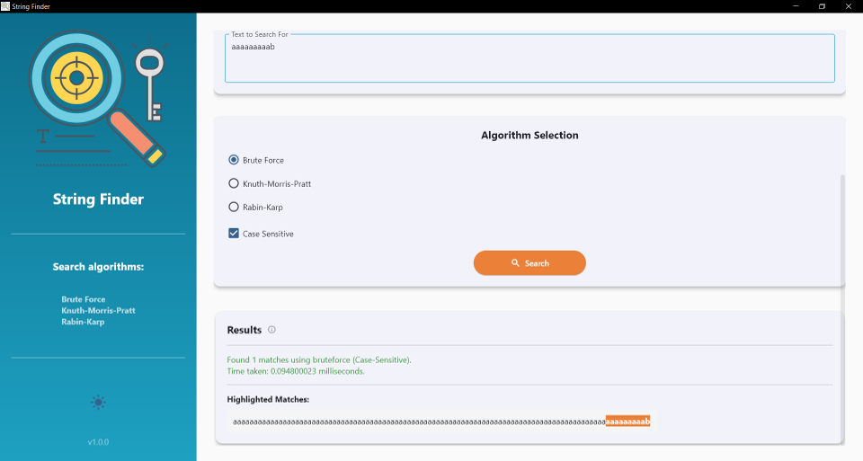
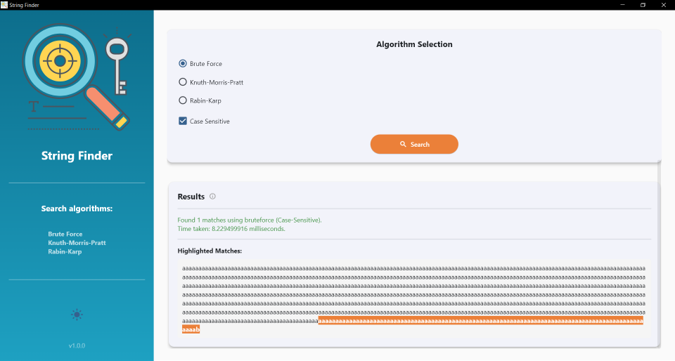
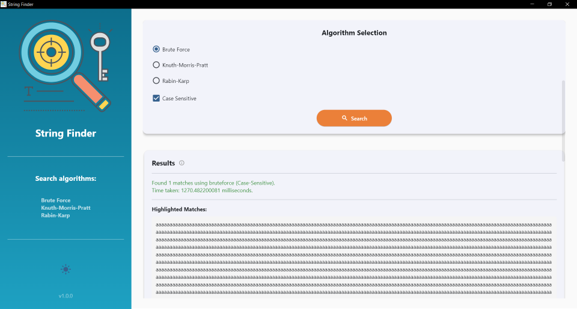
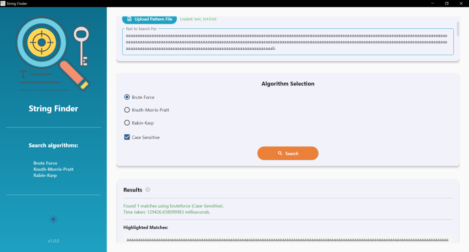
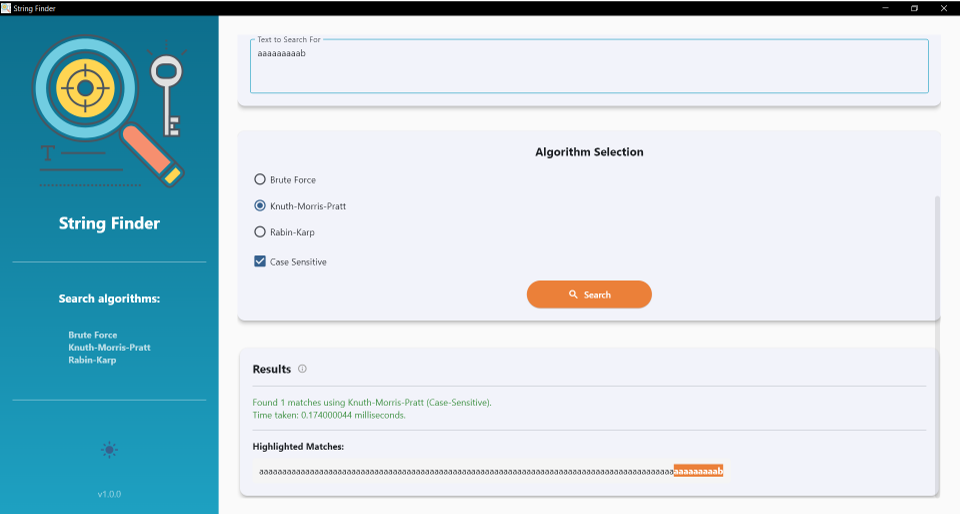
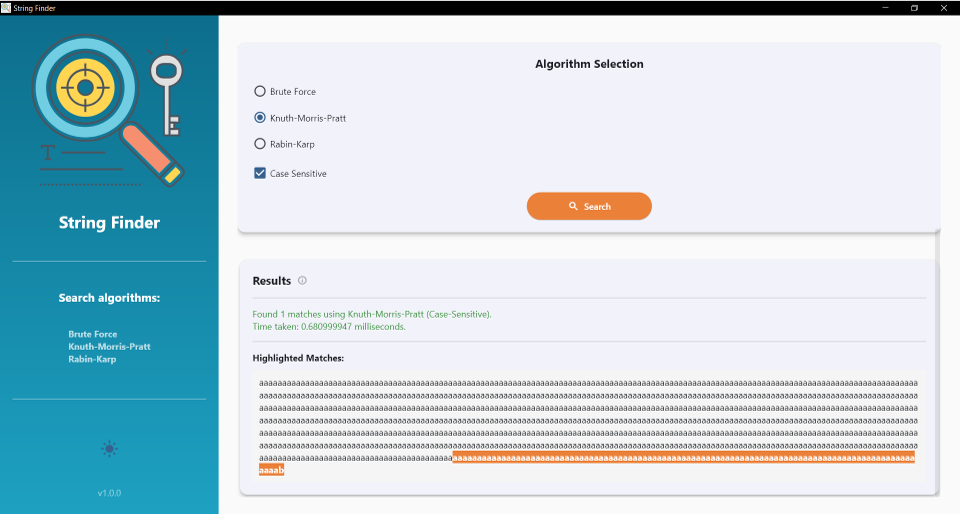
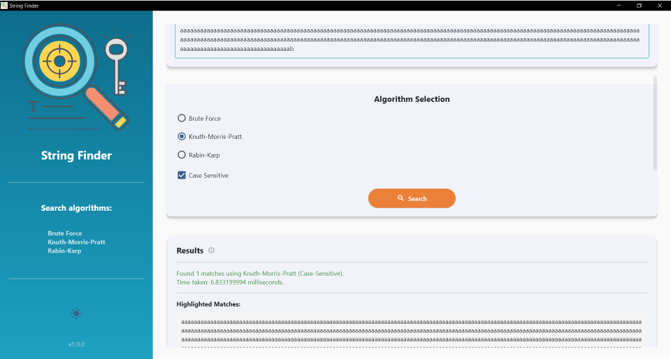
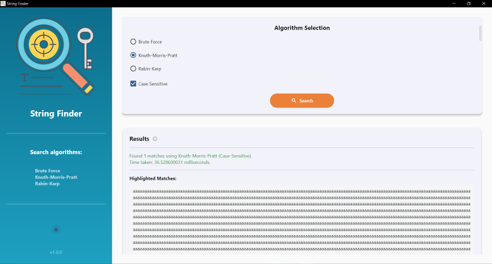
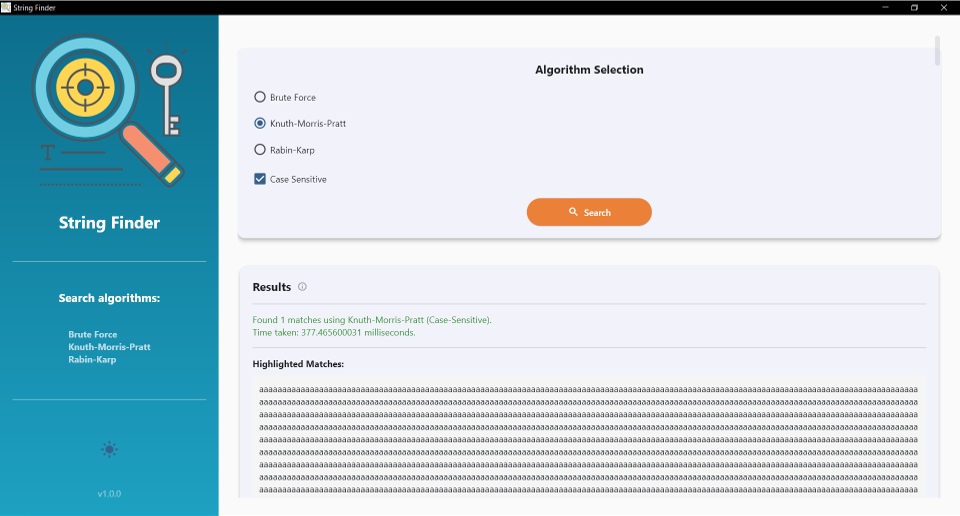

# 🔎 String Finder

**String Finder** is a Python GUI tool built with [Flet](https://flet.dev) that allows you to visualize, compare, and measure the performance of three classical string search algorithms:

* **Brute Force**
* **Knuth–Morris–Pratt (KMP)**
* **Rabin–Karp**

It provides an interactive interface for uploading text and pattern files, searching for occurrences, and displaying matched segments with highlighted results.

---

## ✨ Features

* 🔍 Search text using **Brute Force**, **KMP**, or **Rabin–Karp** algorithms.
* 🔄 Upload or paste text and pattern files.
* ⏱️ Displays **execution time** in milliseconds.
* 💡 Case-sensitive or case-insensitive searching.
* 🎨 Highlighted matches in the text output.
* 🌑 Toggle between **Light** and **Dark** themes.
* 🔄 Simple algorithm selection via radio buttons.
* 🔄 Clean UI with sidebar and welcome screen.

---

## 💡 Algorithms Implemented

### 1. Brute Force

Compares the pattern against every substring of the text.

**Time Complexity:** `O(n × m)`

### 2. Knuth–Morris–Pratt (KMP)

Uses a prefix table to skip unnecessary character comparisons.

**Time Complexity:** `O(n + m)`

### 3. Rabin–Karp

Employs rolling hash computation for efficient substring comparisons.

**Time Complexity:** `O(n + m)` (average), `O(n × m)` (worst case)

---

## 🛠️ Installation

### 1. Clone the repository

```bash
git clone https://github.com/yourusername/string-finder.git
cd string-finder
```

### 2. Install dependencies

Make sure Python 3.8+ is installed, then install [Flet](https://pypi.org/project/flet/):

```bash
pip install flet
```

### 3. Run the app

```bash
python main.py
```

---

## 🔌 Usage

1. Launch the app.
2. Paste or upload your **text** and **pattern**.
3. Select one of the algorithms:

   * Brute Force
   * Knuth-Morris-Pratt
   * Rabin-Karp
4. Toggle **Case Sensitive** if needed.
5. Click **Search**.
6. View execution time and results.
7. Check highlighted matches in the results area.

---

## 🔄 Interface Overview

| Section            | Description                                                          |
| ------------------ | -------------------------------------------------------------------- |
| **Sidebar**        | Displays logo, app title, algorithms list, and theme toggle.         |
| **Main Panel**     | Input fields, upload buttons, algorithm selector, and result viewer. |
| **Welcome Screen** | Intro page with app description and *Get Started* button.            |

---

## 🌐 File Structure

```
string-finder/
├── main.py             # Main program file
├── icon.svg            # App icon (for sidebar)
├── bgimage.png         # Welcome screen image
└── README.md           # Documentation file
```

---

## 📊 Performance Summary

| Algorithm   | Complexity   | Advantage                | Limitation            |
| ----------- | ------------ | ------------------------ | --------------------- |
| Brute Force | O(n × m)     | Simple implementation    | Slow for large inputs |
| KMP         | O(n + m)     | Fast, avoids re-checking | Needs preprocessing   |
| Rabin-Karp  | O(n + m) avg | Efficient hashing        | Collisions possible   |

---

## 👤 Author

**Mosaab GK Abdelaleem**
*String Finder Project Developer*

---

## 🔒 License

This project is open-source under the **MIT License**.

---

## 🎨 Preview


---

> ⚡ *String Finder: explore algorithms visually, measure performance, and learn interactively!*

# String Finder

**Version:** 1.0.0
**Author:** Mosaab Abdelaleem
**License:** MIT

## Overview

String Finder is a graphical desktop application built with [Flet](https://flet.dev/) that allows users to search for a specific pattern within a given text using multiple string-matching algorithms. It provides both text and visual highlighting of search results, along with detailed performance timing for each algorithm.

## Features

* Interactive GUI powered by **Flet**.
* Supports three popular string-search algorithms:

  * **Brute Force Search**
  * **Knuth-Morris-Pratt (KMP)**
  * **Rabin-Karp**
* **Case sensitivity toggle** for flexible matching.
* Upload text and pattern files directly from your system.
* Displays search results with highlighted matches.
* Reports **execution time** in milliseconds.
* Light and Dark theme support.

## Algorithms

### 1. Brute Force Search

A simple approach that checks for the pattern at every possible position in the text.

### 2. Knuth-Morris-Pratt (KMP)

An efficient algorithm that preprocesses the pattern to avoid redundant comparisons using a prefix function.

### 3. Rabin-Karp

Uses hashing to compare pattern and substring values, allowing fast string matching, especially for multiple patterns.

## Installation

### Prerequisites

Ensure you have **Python 3.10+** installed. Then, install Flet:

```bash
pip install flet
```

### Run the Application

Clone or download the project, then execute:

```bash
python main.py
```

## Usage

1. Launch the application.
2. Load or type your **text** in the input field.
3. Load or type your **pattern** to search for.
4. Choose a **search algorithm**.
5. Select whether the search is **case-sensitive**.
6. Click **Search** to find all matches.
7. View results and highlighted occurrences directly in the app.

## File Uploads

* You can upload text files for both input text and search pattern.
* The app supports UTF-8 encoded `.txt` files.

## Performance

Each algorithm reports its **execution time** using the `timeit` module, allowing you to compare their performance on the same input.

## Project Structure

```
├── main.py              # Main Flet application
├── icon.svg             # Sidebar icon (if included)
├── bgimage.png          # Welcome screen background
├── README.md            # Project documentation
```

## Screenshots











## Future Improvements

* Add support for additional algorithms (e.g., Boyer-Moore, Aho-Corasick)
* Export results as reports (CSV/JSON)
* Include benchmarking graphs

## License

This project is licensed under the MIT License - see the [LICENSE](LICENSE) file for details.
